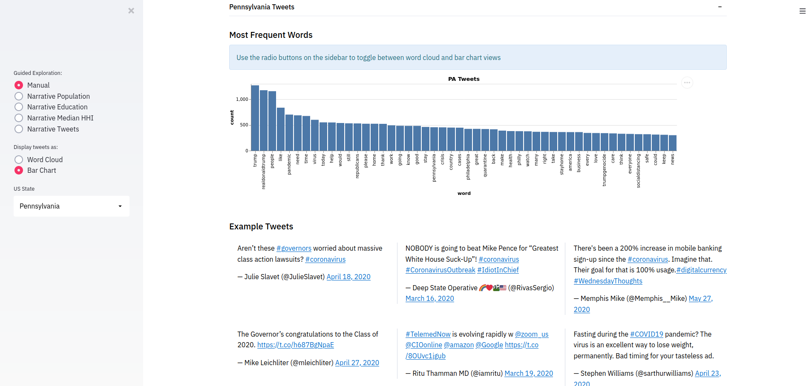
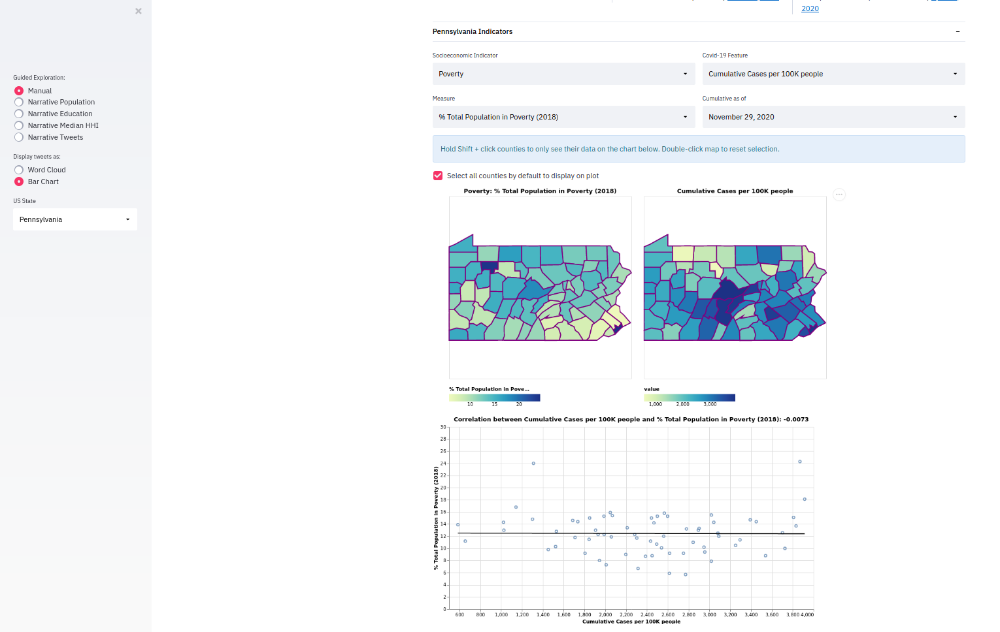
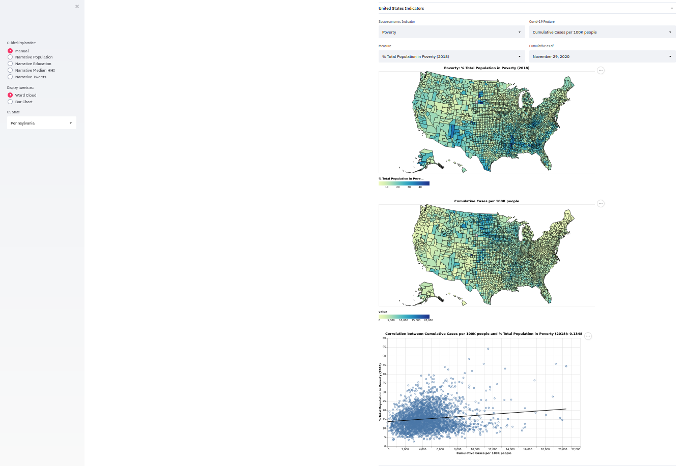

# CMU Interactive Data Science Final Project [](https://share.streamlit.io/cmu-ids-2020/fp-mythbusters/main)

* **Online URL**: https://share.streamlit.io/cmu-ids-2020/fp-mythbusters/main
* **Team members**:
  * Contact person: bwarren2@andrew.cmu.edu
  * jkoshako@andrew.cmu.edu
  * jmahler@andrew.cmu.edu
  * vivianle@andrew.cmu.edu
* **Track**: Narrative

## Abstract
Given the rising concerns about the long-standing socioeconomic inequalities in our country that have been exposed since Covid-19 came about, we sought to explore these strong claims and take a data-driven approach to examine the correlation between a region’s socioeconomic makeup and how it has been affected by the virus throughout 2020. We contribute a Streamlit web application with interactive maps and visualizations that enables users to (1) explore the relationships between different socioeconomic indicators and Covid-19 statistics and (2) analyze the most common words used in tweets written by Twitter users from different states throughout the summer of 2020. We supplement our app with a narrative article that both acts as an instructional tutorial and highlights several insights we were able to gain from using our app.

## Summary Images




## Instructions
The easiest way to view our app is through the deployed streamlit app, you can find the url to this above. If you'd like to run the application locally, then follow the instructions below.
1. Install the latest version of Git: https://git-scm.com/book/en/v2/Getting-Started-Installing-Git. Note: If you don't want to download git, then you can extract the repo from GitHub and unzip it in a directory of your choice. You should also skip the `git clone` step if you choose to extract the repo instead of clone it with git.
2. Install the latest version of Python: https://www.python.org/downloads/
3. Install the latest version of PIP: https://pip.pypa.io/en/stable/installing/
4. Install the latest version of Streamlit: https://docs.streamlit.io/en/stable/installation.html
5. Execute the following commands in a directory of your choice, which will clone the repo, download dependencies, and run the app
```bash
git clone https://github.com/CMU-IDS-2020/fp-mythbusters.git
cd fp-mythbusters
pip install -r requirements.txt
streamlit run streamlit_app.py
```

## Link to Paper
[Final Project Report](Report.md)

## Link to Video
[Video Presentation](media/Mythbusters_presentation.mp4)

## Work Distribution

* **Joseph Koshakow**: Joe was responsible for all things tweet related. Joe wrote and executed the scripts to fetch and organize the tweet contents from the Twitter API. Additionally Joe created the tweet word clouds and the tweet bar charts as well as the functionality to switch between the two. Joe also performed the initial LDA analysis on the tweets which ended up not being included in the final project.

* **Vivian Lee**: Vivian was responsible for obtaining the socioeconomic indicator, FIPS, and covid data and for creating the interactive side-by-side state maps. Vivian wrote scripts to fetch the covid data from Carnegie Mellon’s Epidata API and merge it with the socioeconomic and FIPs data, retrieved from federal agency sites like the US Census Bureau and the US Department of Agriculture. These scripts were executed in a Jupyter notebook; the notebook and csv files are saved in this repository to support the reproducibility of this work. Vivian used the Altair visualization library to create the side-by-side county-level state maps and add interactive features to them. These features include Streamlit widgets to control which features are used for color-coding the counties, tooltips to display specific county information, linked highlighting of counties between the maps, and a multi-select feature that allows users to click on multiple counties on the covid map to control which counties' data are displayed on the correlation/time-series plot below the map.

* **James Mahler**: James was responsible for some of the visualizations in the Streamlit app. In particular, he put together the correlation plots and the time series plots that are displayed in the app for certain counties of a state. Additionally, he put together the USA choropleth maps that show the COVID data for the whole country. James also explored how to make the two state maps side-by-side.

* **Bradley Warren**: Bradley was responsible for putting together the narrative for the app, and putting together the deliverables for both the checkpoint and the final video. After Joe, Vivian and James had put together the core parts of the application, Bradley went through the application and wrote the text to go into the application for the narrative.

## Project Process
### Tweets

The COVID tweet dataset provides 239,861,658 tweet IDs, as well as a subset of those tweet IDs that belong to tweets with geo data. The dataset did not provide the actual tweet content or any geo data. Therefore we had to use the tweet IDs and the twitter API to get tweet contents as well organize tweets by location. We decided to use the Tweepy library to connect with the Twitter API because we found that it made authentication easy and straightforward, which happened to be the hardest part of using the API.

When fetching tweets some explicitly have the state that they were made in, while others contain more specific locations like “Starbucks at Rockefeller Center”. All tweets contain a longitude and latitude which theoretically makes it possible to derive the state for all US tweets. However we were able to get enough tweets with explicit state locations to make this unnecessary.

The Twitter endpoint we used allowed us to fetch tweets in batches of 100 which made the fetching process significantly faster compared to if we had fetched one tweet at a time. One challenge is that to avoid spamming the Twitter API, Twitter implements a Rate Limiter which limits a user to 900 requests per 15 minutes (or 9000 tweets per 15 minutes). This means we could only fetch 36,000 tweets an hour and also had to implement the logic to catch rate limit errors and sleep for 15 min before resuming our fetching process. Another challenge we faced was that by default Twitter only sends the first 140 characters of a tweet, this created a bias of having twitter usernames being very prevalent in the dataset because they generally appear at the start of a tweet. We had to rerun all of our scripts with an additional query parameter to request the full tweet contents. This whole process was done using python scripts that were run over long periods of time.

We initially displayed the tweet data as a word cloud as we thought it would be a visually appealing way to display aggregated contents of the tweets. We used a python word cloud library to accomplish this (https://amueller.github.io/word_cloud/index.html). We saw some interesting common themes across states. One of the top words in almost every state was “people”. Also in a lot of the states we see references to the president and local elected officials, some of these are positive/neutral while others are negative. Some examples for negative words taken from PA are “tempgenocide”, “gopgenocide”, and “trumpistheworstpresidentever”. Some positive/neutral examples taken from Oklahoma are “president”, “realdonaldtrump” (the twitter handle for president Trump), “trump”, and “govstitt” (the twitter handle for the governor of Oklahoma)
    
We transformed the state word clouds from a black rectangle to be in the shape of the corresponding state. Not only was it more visually appealing but it was actually an effective way of encoding the location of the tweets into the image itself. This way when people look at the word cloud they immediately associate it with a particular state. One thing that we noticed was that generating the word clouds was a bit slow, but the actual image generated was always the same. This was due to the fact that we weren’t refetching the tweet contents everytime, making all the words static. So instead of generating the word cloud every time, we generated it once and saved an image of the word cloud. We would then just load that image for each state. This significantly improved performance and lowered the size of our cache.

One suggestion from the TAs was that we should consider replacing the word clouds with bar charts of the words. To allow for flexibility we added radio buttons that allowed the user to toggle between word clouds and bar charts. They both encode and present the same data but they have slightly different pros and cons. Word clouds are visually more appealing and it’s easier to squeeze more words into them. Bar charts give more accurate numbers for each word and allow you to more easily compare words and give you a sense of scale. Due to the pros and cons of each approach we thought that it is mostly a user preference and decided to have the functionality to include both depending on the user’s preference.

## Deliverables

### Proposal

- [X] The URL at the top of this readme needs to point to your application online. It should also list the names of the team members.
- [X] A completed proposal. The contact should submit it as a PDF on Canvas.

### Design review

- [X] Develop a prototype of your project.
- [X] Create a 5 minute video to demonstrate your project and lists any question you have for the course staff. The contact should submit the video on Canvas.

### Final deliverables

- [X] All code for the project should be in the repo.
- [X] A 5 minute video demonstration.
- [ ] Update Readme according to Canvas instructions.
- [X] A detailed project report. The contact should submit the video and report as a PDF on Canvas.

## Data References

1. Data from Delphi COVIDcast. Obtained via the Delphi Epidata API. https://cmu-delphi.github.io/delphi-epidata/api/covidcast.html
2. Kerchner, D., and Wrubel, L. 2020. Coronavirus Tweet Ids. (June 2020). Retrieved December 9, 2020 from Harvard Dataverse V7 https://doi.org/10.7910/DVN/LW0BTB
3. Gupta, S. 2020. How COVID-19 worsened gender inequality in the U.S. workforce. (September 2020). Retrieved December 9, 2020 from https://www.sciencenews.org/article/covid19-worsened-gender-inequality-us-workforce 
4. Patel, J.A. et al. 2020. Poverty, inequality and COVID-19: the forgotten vulnerable. (May 2020). Retrieved December 9, 2020 from http://www.sciencedirect.com/science/article/pii/S0033350620301657 
5. Ray, R. 2020. Why are Blacks dying at higher rates from COVID-19? (April 2020). Retrieved December 9, 2020 from https://www.brookings.edu/blog/fixgov/2020/04/09/why-are-blacks-dying-at-higher-rates-from-covid-19/ 
6. U.S. Bureau of Labor Statistics. 2020. Ability to work from home: evidence from two surveys and implications for the labor market in the COVID-19 pandemic : Monthly Labor Review. (June 2020). Retrieved December 9, 2020 from https://www.bls.gov/opub/mlr/2020/article/ability-to-work-from-home.htm 
7. U.S. Department of Agriculture. 2018. County-level datasets. Retrieved December 2, 2020 from https://www.ers.usda.gov/data-products/county-level-data-sets/ 
