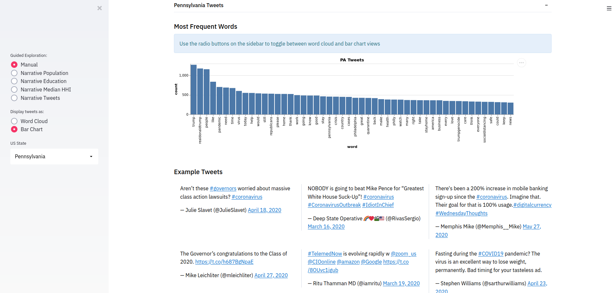
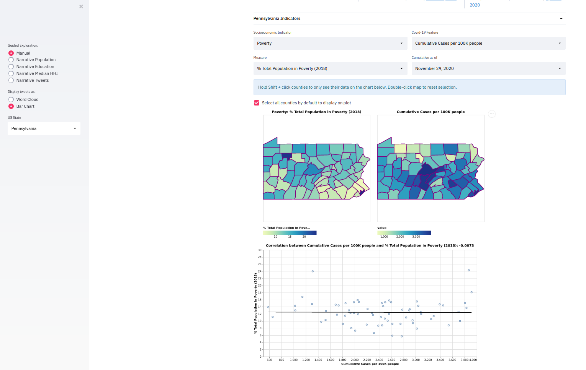

# CMU Interactive Data Science Final Project [](https://share.streamlit.io/cmu-ids-2020/fp-mythbusters/main)

* **Online URL**: https://share.streamlit.io/cmu-ids-2020/fp-mythbusters/main
* **Team members**:
  * Contact person: bwarren2@andrew.cmu.edu
  * jkoshako@andrew.cmu.edu
  * jmahler@andrew.cmu.edu
  * vivianle@andrew.cmu.edu
* **Track**: Narrative

## Abstract
**TODO**

## Summary Images



## Instructions
The easiest way to view our app is through the deployed streamlit app, you can find the url to this above. If you'd like to run the application locally, then follow the instructions below.
1. Install the latest version of Python: https://www.python.org/downloads/
2. Install the latest version of PIP: https://pip.pypa.io/en/stable/installing/
3. Install the latest version of Streamlit: https://docs.streamlit.io/en/stable/installation.html
4. Execute the following commands in a directory of your choice, which will clone the repo, download dependencies, and run the app
```bash
git clone https://github.com/CMU-IDS-2020/fp-mythbusters.git
cd fp-mythbusters
pip install -r requirements.txt
streamlit run streamlit_app.py
```

## Link to Paper
**TODO**

## Link to Video
**TODO**

## Work distribution

* **Joseph Koshakow**: Joe was responsible for all things tweet related. Joe wrote and executed the scripts to fetch and organize the tweet contents from the Twitter API. Additionally Joe created the tweet word clouds and the tweet bar charts as well as the functionality to switch between the two. Joe also performed the initial LDA analysis on the tweets which ended up not being included in the final project.

* **Vivian Lee**: Vivian was responsible for obtaining the socioeconomic indicator, FIPS, and covid data and for creating the interactive side-by-side state maps. Vivian wrote scripts to fetch the covid data from Carnegie Mellon’s Epidata API and merge it with the socioeconomic and FIPs data, retrieved from federal agency sites like the US Census Bureau and the US Department of Agriculture. These scripts were executed in a Jupyter notebook; the notebook and csv files are saved in this repository to support the reproducibility of this work. Vivian used the Altair visualization library to create the side-by-side county-level state maps and add interactive features to them. These features include Streamlit widgets to control which features are used for color-coding the counties, tooltips to display specific county information, linked highlighting of counties between the maps, and a multi-select feature that allows users to click on multiple counties on the covid map to control which counties' data are displayed on the correlation/time-series plot below the map.

* **James Mahler**: James was responsible for some of the visualizations in the Streamlit app. In particular, he put together the correlation plots and the time series plots that are displayed in the app for certain counties of a state. Additionally, he put together the USA choropleth maps that show the COVID data for the whole country. James also explored how to make the two state maps side-by-side.

* **Bradley Warren**: Bradley was responsible for putting together the narrative for the app, and putting together the deliverables for both the checkpoint and the final video. After Joe, Vivian and James had put together the core parts of the application, Bradley went through the application and wrote the text to go into the application for the narrative.

## Project Process
**TODO**

## Deliverables

### Proposal

- [X] The URL at the top of this readme needs to point to your application online. It should also list the names of the team members.
- [X] A completed proposal. The contact should submit it as a PDF on Canvas.

### Design review

- [X] Develop a prototype of your project.
- [X] Create a 5 minute video to demonstrate your project and lists any question you have for the course staff. The contact should submit the video on Canvas.

### Final deliverables

- [X] All code for the project should be in the repo.
- [ ] A 5 minute video demonstration.
- [ ] Update Readme according to Canvas instructions.
- [ ] A detailed project report. The contact should submit the video and report as a PDF on Canvas.

## Data References

Kerchner, Daniel; Wrubel, Laura, 2020, "Coronavirus Tweet Ids", https://doi.org/10.7910/DVN/LW0BTB, Harvard Dataverse, V7 
