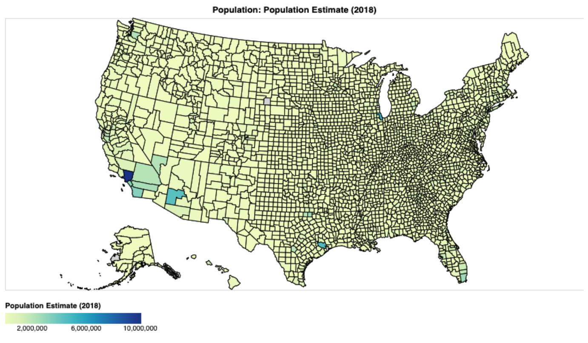

# Final Project Report

**Project URL**: https://share.streamlit.io/cmu-ids-2020/fp-mythbusters/main

**Abstract**: Given the rising concerns about the long-standing socioeconomic inequalities in our country that have been exposed 
since Covid-19 came about, we sought to explore these strong claims and take a data-driven approach to examine the 
correlation between a region’s socioeconomic makeup and how it has been affected by the virus throughout 2020. We 
contribute a Streamlit web application with interactive maps and visualizations that enables users to (1) explore the 
relationships between different socioeconomic indicators and Covid-19 statistics and (2) analyze the most common words 
used in tweets written by Twitter users from different states throughout the summer of 2020. We supplement our app with 
a narrative article that both acts as an instructional tutorial and highlights several insights we were able to gain 
from using our app. 

## Introduction
In this work, we present a Streamlit web application with interactive visualizations that enable the exploration of the 
relationships between different socioeconomic indicators, posts on Twitter (tweets) and Covid-19 statistics across 
United States counties. We demonstrate the utility of our app with a mini case study where we explore the Bureau of 
Labor Statistics’ claim about the role the ability to telework has on covid susceptibility.  We present our insights in 
the form of an interactive narrative embedded in our app which doubles as a guided tutorial that teaches users how to 
use the app to explore their own questions and encourages them to develop evidence-based opinions.

## Related Work
 Our work was motivated by increasing calls for awareness of social inequalities in our country that have been exposed 
 by Covid-19. These include news articles and paper publications about African-Americans experiencing a disproportionate 
 number of Covid-related deaths, reduced childcare services and subsequent increase in female unemployment, and Covid’s 
 negative impact on poor and vulnerable groups [[5](https://www.brookings.edu/blog/fixgov/2020/04/09/why-are-blacks-dying-at-higher-rates-from-covid-19/),
 [3](https://www.sciencenews.org/article/covid19-worsened-gender-inequality-us-workforce), [4](http://www.sciencedirect.com/science/article/pii/S0033350620301657)]. 
 Such articles have sparked both discussions and debates between our own friends and families. As a result, we decided 
 to create an app that would use publicly available data to help support or dispel users’ beliefs and opinions. We show 
 examples of how the app helped answer a few of our own initial questions and the additional insights we were able to 
 gain from it in our results below.

## Methods

**Initial Hypotheses:** We started by writing down a set of questions about the virus’ impact; these came from commonly 
held beliefs and hearsay among our personal social networks and newsfeeds (Table 1).

| Questions (Correlations Explored)                | Hypothesis | Nationwide Result |
|--------------------------------------------------|------------|-------------------|
| Population vs number of covid cases              | Positive   | Negative (-0.07)  |
| Poverty vs number of covid cases                 | Positive   | Positive (0.13)   |
| Median household income vs number of covid cases | None       | Negative (-0.15)  |
| Education level vs number of covid cases         | Negative   | Negative (-0.16)  |

Table 1: Our set of questions explored, initial hypotheses prior to looking at the data, and the actual results along 
with their correlations when considering all US counties

**Datasets:** We acquired the data for our app from established public sources like the Delphi Research Group at 
Carnegie Mellon University (Delphi), the United States Department of Agriculture (USDA), and Twitter 
[[1](https://www.bls.gov/opub/mlr/2020/article/ability-to-work-from-home.htm), [7](https://www.ers.usda.gov/data-products/county-level-data-sets/)]. 
Once our data was organized and visualizations implemented, we used our app to see what answers the data could provide 
to our questions.

#### Tweets Analysis

**Data Retrieval:** Twitter has a public [API](https://developer.twitter.com/en/docs/twitter-api) that allows you to 
programmatically fetch tweets and tweet related data. Our COVID tweet dataset provides 239,861,658 tweet IDs, but did 
not provide the actual tweet content or any geo location [[2](https://dataverse.harvard.edu/dataset.xhtml?persistentId=doi:10.7910/DVN/LW0BTB)]. 
We used the [Tweepy](https://www.tweepy.org/) library to connect with the Twitter API and used the tweet IDs to retrieve 
tweet contents and geo data. We organized the tweets into two categories: (1) Global tweets where we take a random sample 
of roughly 24,000 tweet IDs from all over the world and get the tweet contents. (2) US State tweets where for all the 
tweet IDs with associated geo data, we fetch the tweet contents and store each US state’s tweets separately. 

**Visualization Design Decisions:** We provide two ways to visualize the tweets, with an option for the user to toggle 
between the two options. The first option is through a word cloud, which is a visually appealing way to display 
aggregated contents of tweets that also gives a relative comparison of word use. Additionally for the state tweets we 
shape the word cloud in the shape of the state borders, which allows to encode the state into the visualization as well 
help the user connect the state to the words. The second option is through a bar chart that displays word counts. Bar 
charts give more accurate numbers for each word and allow you to more easily compare words and give a sense of scale. We 
believe that users with different analytical preferences will prefer different different representations for the tweets 
which is why we included both.

#### Socioeconomic Indicators Analysis

**Data Retrieval:** With the understanding that the socioeconomic makeup of a state can vary significantly between its 
counties, we chose to fetch all of the county-level covid data from Delphi’s covidcast endpoint. The span of time varied 
for each feature and we found that some counties had more recorded data than others (Appendix A). 

On our initial fetch, we retrieved raw numbers for the numeric covid features. However, we later switched to retrieving 
features that were scaled appropriately to account for the different population sizes between counties (e.g. the number 
of cases per 100,000 people and percent-based features). We removed data rows with values < 0, deemed impossible, and 
removed rows that represented state totals instead of individual counties. We also merged the covidcast datasets with 
the US Census Bureau’s 2019 FIPS Codes dataset to obtain the county names. For our socioeconomic indicator data, we used 
the most recent data published by the USDA. In our analysis, we look at the following 4 indicator categories: Poverty 
(2018), Unemployment and Median Household Income (2018), Population (2018), and Education (2014-2018). Each indicator 
has a number of different features measured. For brevity, we do not list them here but encourage readers to check out 
our app online.

**Visualization Design Decisions:** We used the Altair visualization library to create two side-by-side maps for each 
US state. The counties on the left map are colored based on the user-selected socioeconomic feature and those on the 
right map based on the user-selected covid statistic. We also add interactive features like tooltips, linked 
highlighting for counties between the two maps, and the ability to select which counties are displayed or not displayed 
on the correlation and time series plots below the maps by clicking on the counties on the covid state map. Users can 
change the default behavior of the multi-select feature (all vs none) by clicking a checkbox above the map. We organize 
our covid features into two distinct groups: cumulative and daily. Each cumulative feature is accompanied by a 
correlation plot between itself and the selected socioeconomic feature. Users can specify the date range and aggregate 
function used for the daily features. These are accompanied by a time series plot to show the change in the daily feature 
over the specified date range for the selected counties. We use layering and add a gray background behind the maps to 
handle cases where a county has no data for the selected feature.l

Though the side-by-side state maps allowed for easy intra-state comparisons, we received feedback that our app design 
did not facilitate inter-state comparisons. At that iteration of our app, the user could manually change the state 
displayed by selecting a new state from a dropdown list in the sidebar but could not view multiple states simultaneously 
unless they had multiple browser windows open. In response to this feedback, we decided to add similar interactive maps 
to compare socioeconomic and covid features across the entire United States. With these new maps, the user can see how 
all of the counties in the US compare. These maps enable a fuller birds-eye view of the socioeconomic and covid 
differences across the country and allow the user to identify clusters or belts of counties that have similar metrics.

## Results

The results of our analysis are summarized in Table 1. We used additional news articles and research publications that 
covered topics similar to the questions we explored to get a better understanding of our results and find hidden 
variables in some of the correlations. 

We were surprised to see a weak negative relationship (-0.07) between county population size and cumulative number of 
covid cases per 100K people, given some of the early news articles that suggested a positive correlation between 
population density and covid cases (Appendix B and C). When we look at the correlations within individual states, 
we find that they are not consistent. Florida shows a negative correlation (-0.11), California and New York show 
positive correlations (0.13 and 0.59), and Washington seems to show virtually no correlation (-0.01) for these variables. 
So ultimately we conclude that population size is not an indicative feature for predicting covid susceptibility.

The Bureau of Labor and Statistics (Bureau) has suggested that the ability to work from home (telework) is a hidden 
variable in estimating covid’s impact [[6](https://www.bls.gov/opub/mlr/2020/article/ability-to-work-from-home.htm)]. 
We use our app to explore additional correlations that can support the validity of their claim. We find that there is 
indeed a positive correlation (0.12) between low education (percentage of adults who did not complete high school) and 
the cumulative number of cases in a US county. Conversely, there is a negative correlation (-0.16) between the 
percentage of adults who completed high school and cumulative number of cases in a county. Since high-paying white collar 
jobs result in higher median household income (MHHI), we analyze that socioeconomic feature next and find a negative 
correlation (-0.15) between MHHI and cumulative cases (Appendix B, D, E). Our results support the Bureau’s claim; we find 
that the ability to telework is largely influenced by socioeconomic factors and it in turn has a large influence on 
the size of the negative impact covid has on a county.

## Discussion

In this project, we were able to put together an application that lets users explore COVID data across the United States.
Users are able to explore the association between various demographic data, such as income and education, and various
 COVID metrics, such as cumulative and incident cases, related deaths, mask wearing, and more on a county-by-county basis 
 across the United States. This lets users see whether or not their inferences about such associations is backed up by 
 data or not. We also allow users to see how COVID is being talked about in different states, with the use of word 
 clouds and word frequency charts from Twitter data.

**Limitations:**  One primary limitation of our work is the lack of more data to explore. There are many more questions 
to be asked on this topic (see the next section), but there is only so much time and data available for this project. 
More socioeconomic features could have led to the uncovering of additional hidden variables and correlations. Some 
counties had little to no data for certain features so we were unable to develop a conclusive insight about their 
individual socioeconomic and covid correlations.

## Future Work

There are several ways in which our work could be built upon. One interesting thing to look at would be the 
association between major events and the COVID data in the following weeks following such events. For example, 
one could look at whether or not COVID cases spiked after large gatherings such as political events (i.e. Trump rallies). 
Another such study could be the trend in COVID cases in college towns when students returned to campus. Many in the 
media have suggested that these events have led to significant increases in COVID cases, so it would be interesting to 
analyze the data to see whether or not these claims have data to support them.

Lastly, our work could be built upon by studying the economics of the pandemic. We know that the pandemic has led to a 
large increase in unemployment, and that many small businesses have been forced to close. This leads to many potential 
questions: who is suffering the most economically? How have strict lockdowns played a role in this? And many more.

## References
1. Data from Delphi COVIDcast. Obtained via the Delphi Epidata API. https://cmu-delphi.github.io/delphi-epidata/api/covidcast.html
2. Kerchner, D., and Wrubel, L. 2020. Coronavirus Tweet Ids. (June 2020). Retrieved December 9, 2020 from Harvard Dataverse V7 https://doi.org/10.7910/DVN/LW0BTB
3. Gupta, S. 2020. How COVID-19 worsened gender inequality in the U.S. workforce. (September 2020). Retrieved December 9, 2020 from https://www.sciencenews.org/article/covid19-worsened-gender-inequality-us-workforce 
4. Patel, J.A. et al. 2020. Poverty, inequality and COVID-19: the forgotten vulnerable. (May 2020). Retrieved December 9, 2020 from http://www.sciencedirect.com/science/article/pii/S0033350620301657 
5. Ray, R. 2020. Why are Blacks dying at higher rates from COVID-19? (April 2020). Retrieved December 9, 2020 from https://www.brookings.edu/blog/fixgov/2020/04/09/why-are-blacks-dying-at-higher-rates-from-covid-19/ 
6. U.S. Bureau of Labor Statistics. 2020. Ability to work from home: evidence from two surveys and implications for the labor market in the COVID-19 pandemic : Monthly Labor Review. (June 2020). Retrieved December 9, 2020 from https://www.bls.gov/opub/mlr/2020/article/ability-to-work-from-home.htm 
7. U.S. Department of Agriculture. 2018. County-level datasets. Retrieved December 2, 2020 from https://www.ers.usda.gov/data-products/county-level-data-sets/ 

## Appendix

**Appendix A:** Covid-19 Feature and the available date range for each dataset. Note that the available date range for 
counties within the same dataset varied as some counties did not have as much recorded data as others. This data was 
fetched on Dec 2, 2020.

| Covid-19 Feature                                | Earliest Date Available | Latest Date Available |
|-------------------------------------------------|-------------------------|-----------------------|
| Cumulative Cases per 100K people                | N/A                     | Nov 29, 2020          |
| Daily New Cases per 100K people                 | Jan 25, 2020            | Nov 29, 2020          |
| Cumulative Deaths per 100K people               | N/A                     | Nov 29, 2020          |
| Daily Deaths per 100K people                    | Jan 25, 2020            | Nov 29, 2020          |
| Daily % Covid-Related Doctor Visits             | Feb 1, 2020             | Nov 27, 2020          |
| % People Wearing Masks in Public in Past 5 Days | Sep 8, 2020             | Nov 30, 2020          |
| % People Tested for Covid-19 in Past 14 Days    | Sep 8, 2020             | Nov 30, 2020          |
| % Positive Covid Tests in Past 14 Days          | Sep 9, 2020             | Nov 30, 2020          |
| % People Not Tested who Wanted Tests            | Sep 8, 2020             | Nov 30, 2020          |

**Appendix B:** Map of US counties colored based on their cumulative number of Covid-19 cases per 100K people as of Nov 29, 2020. 
Values increase as color changes from light green to dark blue.

**Appendix C:** Map of US counties colored based on their estimated populations in 2018 recorded by the USDA. Values 
increase as color changes from light green to dark blue.

**Appendix D:** Map of US counties colored based on their reported median household incomes in 2018 recorded by the USDA.
Values increase as color changes from light green to dark blue.

**Appendix E:** Correlation plot of median household income (2018) vs cumulative number of Covid-19 cases per 100K 
people as of Nov 29, 2020. The plot shows a negative correlation (-0.1491) between the two features.

